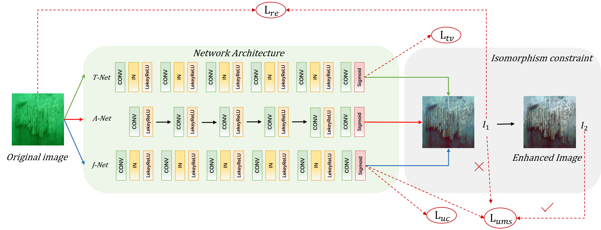

# Zero-UMSIE


<div align=center></div>

## Introduction
In this project, we use Python 3.7, Pytorch 1.13.0 and one NVIDIA RTX 3080Ti GPU. 

## Datasets and results
Training dataset, testing dataset, and our predictions are available at [Google Drive]().

### Testing

The pretrained model is in the ./weights.

Check the model and image pathes in eval.py, and then run:

```
python new_test.py
```

### Training

To train the model, you need to prepare our training dataset.

Check the dataset path in main.py, and then run:
```
python train.py
```
